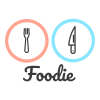

## Module Two Project

========================

## Foodie




This app is a Rails driven program that let's you navigate through the Foodie network. It's a way to create and see other Chef's, Dish's, and Restaurant's.


The database the dishes information is seeded from is [Recipe Puppy](http://www.recipepuppy.com/about/api/). From this API we were able to glean photo's and ingredients for a variety of different dishes.  

## Installation

Make sure you have the Ruby language installed

Fork and Clone the repository from https://github.com/seanwatters/rails-project-mode-seattle-web-career-042219

Navigate to the folder with cd rails-project-mode-seattle-web-career-042219

Run the initial migration and seeding: the seeding might take a few minutes

```
rails db:setup
```

Run bundle install

```
bundle install
```


Run the program

```
rails s
```


Now were to navigate through Foodie.


## Usage

Once the app has launched you will need to create an account and then your free to navigate through the website. Add Chefs, Restaurants, or Dishes, give other users favorites and comments, and look through your own profile page. When uploading images use the image address in url form.  


## Credits
A project by [Alex Borst](https://github.com/ButlerBorst) and [Sean Watters](https://github.com/seanwatters)

Gems Used:
* Scope the Gemfile
